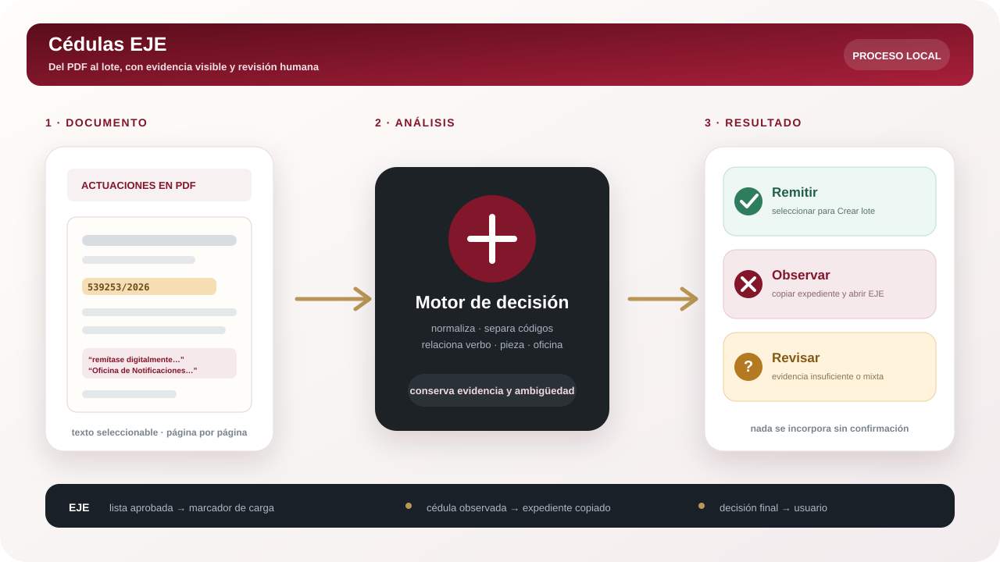

<p align="center">
  
</p>

<h2 align="center">Del PDF al lote, sin copiar una por una.</h2>

<p align="center">
  Analiza actuaciones de confronte, distingue remisiones y observaciones y mantiene la decisión final bajo control humano.
</p>

<p align="center">
  <a href="https://sinergiaestudio.github.io/Cedulas-EJE-v1.0/"><strong>Abrir Cédulas EJE</strong></a>
  ·
  <a href="https://sinergiaestudio.github.io/herramientas-j15sec29/">Herramientas SEC29</a>
  ·
  <a href="#criterios-de-decisión">Criterios</a>
  ·
  <a href="#privacidad-y-límites">Privacidad</a>
</p>

<p align="center">
  
  
  
  
  
</p>

---

## Qué es Cédulas EJE

Cédulas EJE es una herramienta web para analizar PDFs con actuaciones de confronte y asistir la preparación de lotes de notificaciones en EJE.

La aplicación identifica los códigos de cédula, interpreta el sentido de la providencia y separa cuatro situaciones:

- piezas que deben **remitirse** a la Oficina de Notificaciones del fuero;
- cédulas que fueron expresamente **observadas**;
- supuestos **ambiguos** que requieren revisión;
- actuaciones **ajenas** al circuito, que deben ignorarse.

El análisis no reemplaza la lectura judicial. Su función es reducir la búsqueda manual, mostrar la evidencia y concentrar el control humano en los casos relevantes.

> **Automatizar la selección no significa delegar la decisión.**

## Flujo operativo

<p align="center">
  
</p>

```text
PDF de actuaciones
        ↓
Lectura y normalización
        ↓
Remitir · Observar · Revisar · Ignorar
        ↓
Lista aprobada / acceso asistido a EJE
```

## Criterios de decisión

| Resultado | Condición principal | Tratamiento |
|---|---|---|
| **Remitir** | La actuación ordena expresamente remitir digitalmente la pieza a la Oficina de Notificaciones para su diligenciamiento. | La cédula puede seleccionarse para el lote. |
| **Observar** | La providencia individualiza una cédula y dispone expresamente su observación. | Se excluye del lote y aparece la acción **Observar**. |
| **Revisar** | Hay códigos, lenguaje parcial, actuación mixta o evidencia insuficiente para una decisión segura. | No se incorpora automáticamente. |
| **Ignorar** | La actuación no pertenece al circuito de remisión a la Oficina de Notificaciones. | Se descarta del listado operativo. |

La detección contempla:

- remisiones en singular y plural;
- actuaciones mixtas con piezas remitidas y observadas;
- códigos repetidos;
- cédulas Ley 22.172 ajenas al circuito;
- números de actuación que no deben confundirse con códigos de cédula;
- separaciones, guiones invisibles y caracteres de ancho cero introducidos por algunos PDFs;
- evidencia página por página para verificar la clasificación.

## Acción Observar

Desde la versión 1.1.2, las cédulas expresamente observadas muestran el botón **Observar**.

Al presionarlo:

1. se abre o reutiliza una pestaña de EJE;
2. se copia automáticamente el número visible del expediente;
3. la aplicación informa qué expediente quedó copiado;
4. el usuario lo pega en el buscador de EJE y presiona `Enter`.

El flujo es deliberadamente simple y estable. La herramienta no intenta calcular ni consultar el identificador interno `expId` de EJE, no redacta la actuación y no ejecuta ninguna decisión procesal.

## Preparación del lote

Para las cédulas clasificadas como **Remitir**:

1. cargar el PDF;
2. revisar códigos, fundamento y evidencia;
3. confirmar la selección;
4. copiar la lista aprobada;
5. abrir **Crear lote** en EJE;
6. ejecutar el marcador de carga;
7. revisar el resultado y crear el lote manualmente.

El marcador completa el campo correspondiente, pulsa la acción operativa, verifica la incorporación y se detiene cuando no puede confirmar el resultado.

## Diseño de la interfaz

Cédulas EJE forma parte de la familia **Herramientas SEC29** y comparte:

- cabecera institucional no oficial;
- menú lateral minimizado;
- accesos cruzados a los demás módulos;
- tema claro y oscuro;
- paleta bordó, grafito, marfil y dorado apagado;
- procesamiento local y mensajes de seguridad visibles;
- crédito de autoría común.

La marca utiliza una pieza documental, un sobre y una ruta de decisión como síntesis del recorrido **PDF → análisis → lote**.

## Privacidad y límites

- el PDF se procesa íntegramente en el navegador;
- no se envían expedientes, documentos ni credenciales a un servidor;
- no existe base de datos de casos;
- los PDFs escaneados como imagen requieren OCR previo;
- los casos ambiguos deben resolverse mediante lectura humana;
- la creación definitiva del lote permanece bajo control del usuario;
- no deben incorporarse al repositorio PDFs reales, registros de carga ni documentación con datos personales;
- la aplicación no constituye un sistema oficial del Consejo de la Magistratura de la CABA.

## Desarrollo local

Requiere Node.js 22.13 o posterior.

```bash
npm ci
npm run dev
```

Compilación de producción:

```bash
npm run build
```

El workflow de GitHub Pages compila la aplicación y verifica que el bundle publicado conserve la acción **Observar**, la extracción del expediente y la versión correspondiente.

## Estructura principal

```text
src/
├── CedulasApp.tsx       análisis, revisión y resultados
├── ejeBookmarklet.ts    carga asistida dentro de EJE
├── index.css            interfaz y adaptación responsive
└── main.tsx             arranque de React
public/
├── pdf.worker.min.mjs   lectura local del PDF
├── sec29-suite-shell.js navegación común
└── og.png               imagen social
```

## Repositorios relacionados

- [Herramientas SEC29](https://github.com/sinergiaestudio/herramientas-j15sec29)
- [Confronte de Liquidaciones EJF](https://github.com/sinergiaestudio/Confronte-Liquidaciones-EJF-v2.1.0)
- [Perfil de Marcelo Gómez](https://github.com/sinergiaestudio/marcelo-gomez)

## Autoría

Diseño y desarrollo: **[Marcelo Gómez](https://github.com/sinergiaestudio)**  
Juzgado N.º 15 · Secretaría N.º 29  
Biblioteca de Mero Trámite · innovación aplicada a la gestión judicial.
